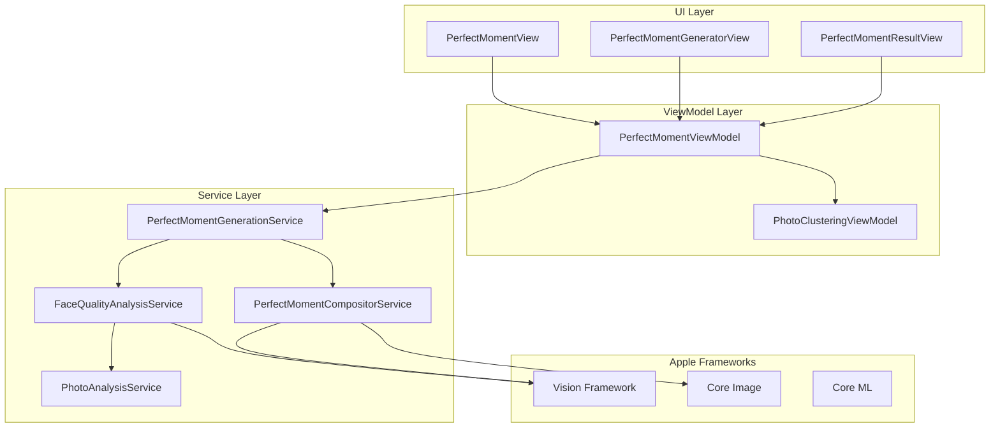
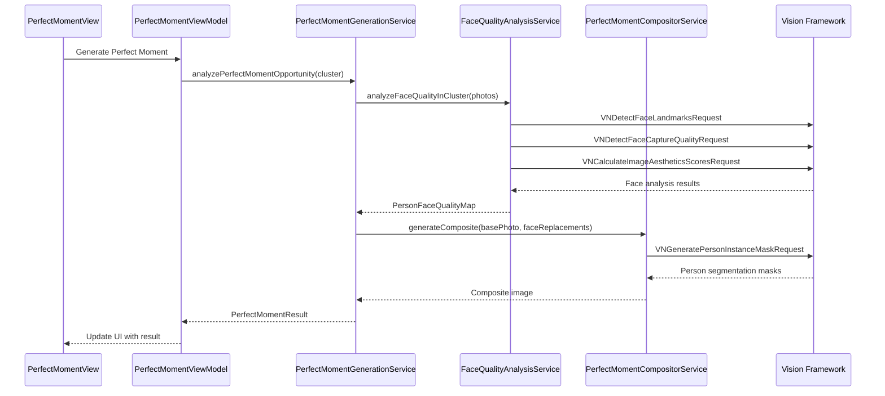

# Perfect Moment Generator - Design Document

## Overview

The Perfect Moment Generator builds upon InsightPic's existing photo clustering and analysis infrastructure to create composite "perfect" group photos. It leverages the cluster of similar photos to identify the best expression for each person and seamlessly blend them into a single flawless image.

## Code Reuse Analysis

### Existing Infrastructure to Leverage

**Core Models (Extend)**:
- `Photo` model - Add perfect moment metadata fields
- `PhotoCluster` model - Add perfect moment eligibility flags
- `PhotoAnalysisResult` - Extend with detailed face analysis data
- `FaceAnalysis` - Enhance with expression scoring

**Services (Extend)**:
- `PhotoAnalysisService` - Add face quality and expression analysis methods
- `PhotoClusteringService` - Add perfect moment cluster validation
- `PhotoLibraryService` - Add image composition utilities
- `ClusterCurationService` - Add perfect moment candidate identification

**ViewModels (Extend)**:
- `PhotoClusteringViewModel` - Add perfect moment generation state management
- Existing async/await patterns and progress tracking

**UI Patterns (Follow)**:
- SwiftUI + ObservableObject architecture
- Glass button design patterns from existing UI
- Progress view patterns from clustering
- Error handling and user feedback patterns

## System Architecture

### Component Overview



### Data Flow Architecture



## Core Components Design

### 1. Enhanced Data Models

```swift
// Extension to existing PhotoCluster
extension PhotoCluster {
    var perfectMomentEligibility: PerfectMomentEligibility {
        PerfectMomentEligibility(
            isEligible: photos.count >= 2 && hasConsistentPeople && hasFaceVariations,
            reason: eligibilityReason,
            confidence: eligibilityConfidence,
            estimatedImprovements: identifyImprovementOpportunities()
        )
    }
}

struct PerfectMomentEligibility {
    let isEligible: Bool
    let reason: EligibilityReason
    let confidence: Float
    let estimatedImprovements: [PersonImprovement]
}

struct PersonImprovement {
    let personID: String
    let currentIssue: FaceIssue // .eyesClosed, .poorExpression, .awkwardPose
    let improvementAvailable: Bool
    let confidence: Float
}

// Extension to existing Photo model
extension Photo {
    var perfectMomentMetadata: PerfectMomentMetadata? {
        get { /* retrieve from metadata */ }
        set { /* store in metadata */ }
    }
}

struct PerfectMomentMetadata: Codable {
    let isGeneratedPerfectMoment: Bool
    let sourcePhotoIds: [UUID]
    let generationTimestamp: Date
    let qualityScore: Float
    let personReplacements: [PersonReplacement]
}

struct PersonReplacement: Codable {
    let personID: String
    let sourcePhotoId: UUID
    let improvementType: ImprovementType
    let confidence: Float
}
```

### 2. Face Quality Analysis Service

```swift
class FaceQualityAnalysisService {
    private let visionAnalyzer = VisionFaceAnalyzer()
    
    func analyzeFaceQualityInCluster(_ cluster: PhotoCluster) async -> ClusterFaceAnalysis {
        var personFaceMap: [PersonID: [FaceQualityData]] = [:]
        
        // Step 1: Analyze all faces in all photos
        for photo in cluster.photos {
            guard let image = await loadImage(photo) else { continue }
            
            let faceAnalyses = await analyzeFacesInPhoto(image, photo: photo)
            
            // Step 2: Match faces across photos (person identification)
            for faceAnalysis in faceAnalyses {
                let personID = await matchPersonAcrossPhotos(faceAnalysis, existingPersons: personFaceMap.keys)
                personFaceMap[personID, default: []].append(faceAnalysis)
            }
        }
        
        // Step 3: Identify best and worst faces for each person
        let personQualityAnalysis = personFaceMap.mapValues { faces in
            PersonFaceQualityAnalysis(
                allFaces: faces,
                bestFace: selectBestFace(from: faces),
                worstFace: selectWorstFace(from: faces),
                improvementPotential: calculateImprovementPotential(faces)
            )
        }
        
        return ClusterFaceAnalysis(
            clusterID: cluster.id,
            personAnalyses: personQualityAnalysis,
            basePhotoCandidate: selectOptimalBasePhoto(cluster.photos),
            overallImprovementPotential: calculateOverallImprovement(personQualityAnalysis)
        )
    }
    
    private func analyzeFacesInPhoto(_ image: UIImage, photo: Photo) async -> [FaceQualityData] {
        var faces: [FaceQualityData] = []
        
        // Vision Framework requests
        let faceRequest = VNDetectFaceRectanglesRequest()
        let landmarksRequest = VNDetectFaceLandmarksRequest()  
        let qualityRequest = VNDetectFaceCaptureQualityRequest()
        let expressionRequest = VNDetectFaceExpressionsRequest() // iOS 18+
        
        let handler = VNImageRequestHandler(cgImage: image.cgImage!)
        
        do {
            try await handler.perform([faceRequest, landmarksRequest, qualityRequest, expressionRequest])
            
            guard let detectedFaces = faceRequest.results else { return [] }
            
            for (index, detectedFace) in detectedFaces.enumerated() {
                let landmarks = landmarksRequest.results?[index].landmarks
                let captureQuality = qualityRequest.results?[index].faceCaptureQuality ?? 0.5
                let expressions = expressionRequest.results?[index] // iOS 18+ only
                
                // Calculate detailed face metrics
                let eyeState = calculateEyeState(landmarks)
                let smileQuality = calculateSmileQuality(landmarks, expressions: expressions)
                let faceAngle = calculateFaceAngle(landmarks)
                let sharpness = await calculateFaceSharpness(image, faceRect: detectedFace.boundingBox)
                
                faces.append(FaceQualityData(
                    photo: photo,
                    boundingBox: detectedFace.boundingBox,
                    landmarks: landmarks,
                    captureQuality: captureQuality,
                    eyeState: eyeState,
                    smileQuality: smileQuality,
                    faceAngle: faceAngle,
                    sharpness: sharpness,
                    overallScore: calculateOverallFaceScore(
                        captureQuality: captureQuality,
                        eyeState: eyeState,
                        smileQuality: smileQuality,
                        faceAngle: faceAngle,
                        sharpness: sharpness
                    )
                ))
            }
        } catch {
            print("Face analysis failed: \(error)")
        }
        
        return faces
    }
    
    private func calculateEyeState(_ landmarks: VNFaceLandmarks2D?) -> EyeState {
        guard let landmarks = landmarks,
              let leftEye = landmarks.leftEye,
              let rightEye = landmarks.rightEye else { 
            return EyeState(leftOpen: true, rightOpen: true, confidence: 0.5) 
        }
        
        let leftEAR = calculateEyeAspectRatio(leftEye.normalizedPoints)
        let rightEAR = calculateEyeAspectRatio(rightEye.normalizedPoints)
        
        // EAR thresholds determined empirically
        let eyeOpenThreshold: Float = 0.25
        
        return EyeState(
            leftOpen: leftEAR > eyeOpenThreshold,
            rightOpen: rightEAR > eyeOpenThreshold,
            confidence: min(leftEAR, rightEAR) / eyeOpenThreshold
        )
    }
    
    private func calculateSmileQuality(_ landmarks: VNFaceLandmarks2D?, expressions: VNFaceExpressionAnalysis?) -> SmileQuality {
        // iOS 18+ has direct smile detection
        if let expressions = expressions {
            return SmileQuality(
                intensity: expressions.smileIntensity,
                naturalness: expressions.smileNaturalness,
                confidence: expressions.confidence
            )
        }
        
        // Fallback: Calculate from lip landmarks
        guard let landmarks = landmarks,
              let outerLips = landmarks.outerLips else {
            return SmileQuality(intensity: 0.5, naturalness: 0.5, confidence: 0.3)
        }
        
        let lipPoints = outerLips.normalizedPoints
        let curvature = calculateLipCurvature(lipPoints)
        let symmetry = calculateLipSymmetry(lipPoints)
        
        return SmileQuality(
            intensity: curvature,
            naturalness: symmetry,
            confidence: 0.7
        )
    }
}

struct FaceQualityData {
    let photo: Photo
    let boundingBox: CGRect
    let landmarks: VNFaceLandmarks2D?
    let captureQuality: Float
    let eyeState: EyeState
    let smileQuality: SmileQuality
    let faceAngle: FaceAngle
    let sharpness: Float
    let overallScore: Float
}

struct EyeState {
    let leftOpen: Bool
    let rightOpen: Bool
    let confidence: Float
    
    var bothOpen: Bool { leftOpen && rightOpen }
}

struct SmileQuality {
    let intensity: Float      // 0.0 = no smile, 1.0 = big smile
    let naturalness: Float    // 0.0 = forced, 1.0 = natural
    let confidence: Float
}

struct FaceAngle {
    let pitch: Float
    let yaw: Float
    let roll: Float
    
    var isOptimal: Bool {
        abs(pitch) < 15 && abs(yaw) < 20 && abs(roll) < 10
    }
}
```

### 3. Perfect Moment Generation Service

```swift
class PerfectMomentGenerationService {
    private let faceAnalyzer = FaceQualityAnalysisService()
    private let compositor = PerfectMomentCompositorService()
    
    func generatePerfectMoment(
        from cluster: PhotoCluster,
        progressCallback: @escaping (PerfectMomentProgress) -> Void
    ) async throws -> PerfectMomentResult {
        
        // Phase 1: Analyze cluster eligibility (0-20%)
        progressCallback(.analyzing("Analyzing photo cluster..."))
        
        guard cluster.perfectMomentEligibility.isEligible else {
            throw PerfectMomentError.clusterNotEligible(cluster.perfectMomentEligibility.reason)
        }
        
        // Phase 2: Detailed face analysis (20-60%)
        progressCallback(.analyzing("Analyzing faces and expressions..."))
        
        let clusterAnalysis = await faceAnalyzer.analyzeFaceQualityInCluster(cluster)
        
        guard clusterAnalysis.overallImprovementPotential > 0.3 else {
            throw PerfectMomentError.insufficientImprovement
        }
        
        // Phase 3: Select optimal replacements (60-70%)
        progressCallback(.selecting("Selecting best expressions..."))
        
        let basePhoto = clusterAnalysis.basePhotoCandidate
        let faceReplacements = selectOptimalFaceReplacements(clusterAnalysis)
        
        // Phase 4: Generate composite (70-100%)
        progressCallback(.compositing("Creating perfect moment..."))
        
        let compositeResult = try await compositor.generateComposite(
            basePhoto: basePhoto,
            faceReplacements: faceReplacements,
            progressCallback: { progress in
                let overallProgress = 0.7 + (progress * 0.3)
                progressCallback(.compositing("Blending faces... \(Int(overallProgress * 100))%"))
            }
        )
        
        // Phase 5: Quality validation
        let qualityValidation = await validateCompositeQuality(compositeResult)
        
        guard qualityValidation.overallQuality > 0.6 else {
            throw PerfectMomentError.compositeQualityTooLow(qualityValidation)
        }
        
        return PerfectMomentResult(
            originalPhoto: basePhoto.photo,
            perfectMoment: compositeResult.composite,
            improvements: faceReplacements.map { PersonImprovement(from: $0) },
            qualityMetrics: compositeResult.qualityMetrics,
            processingTime: compositeResult.processingTime
        )
    }
}

enum PerfectMomentProgress {
    case analyzing(String)
    case selecting(String) 
    case compositing(String)
}

struct PerfectMomentResult {
    let originalPhoto: Photo
    let perfectMoment: UIImage
    let improvements: [PersonImprovement]
    let qualityMetrics: CompositeQualityMetrics
    let processingTime: TimeInterval
}
```

### 4. Perfect Moment Compositor Service

```swift
class PerfectMomentCompositorService {
    private let visionProcessor = VisionCompositeProcessor()
    private let imageProcessor = CoreImageProcessor()
    
    func generateComposite(
        basePhoto: PhotoCandidate,
        faceReplacements: [PersonFaceReplacement],
        progressCallback: @escaping (Float) -> Void
    ) async throws -> CompositeResult {
        
        var workingImage = basePhoto.image
        var totalReplacements = faceReplacements.count
        
        for (index, replacement) in faceReplacements.enumerated() {
            // Update progress
            let progress = Float(index) / Float(totalReplacements)
            progressCallback(progress)
            
            // Step 1: Generate person segmentation mask
            guard let personMask = await generatePersonMask(
                replacement.sourceFace.photo,
                targetFaceRect: replacement.sourceFace.boundingBox
            ) else {
                print("Warning: Could not generate person mask for replacement")
                continue
            }
            
            // Step 2: Extract face region with natural boundaries  
            let extractedFaceRegion = extractFaceWithContext(
                from: replacement.sourceFace.photo,
                personMask: personMask,
                faceData: replacement.sourceFace
            )
            
            // Step 3: Find destination face in current working image
            guard let destinationFace = findDestinationFace(
                in: workingImage,
                for: replacement.personID,
                originalPhoto: basePhoto.photo
            ) else {
                print("Warning: Could not find destination face")
                continue
            }
            
            // Step 4: Align and transform source face
            let alignedFace = try await alignFaceForComposite(
                sourceFace: extractedFaceRegion,
                destinationFace: destinationFace,
                workingImage: workingImage
            )
            
            // Step 5: Composite with seamless blending
            workingImage = try await compositeFaceSeamlessly(
                baseImage: workingImage,
                newFace: alignedFace,
                destinationRegion: destinationFace.expandedRegion
            )
        }
        
        progressCallback(1.0)
        
        return CompositeResult(
            composite: workingImage,
            qualityMetrics: await calculateCompositeQuality(workingImage),
            processingTime: 0 // TODO: Track actual processing time
        )
    }
    
    private func generatePersonMask(_ photo: Photo, targetFaceRect: CGRect) async -> CIImage? {
        guard let image = await loadImage(photo) else { return nil }
        
        let request = VNGeneratePersonInstanceMaskRequest()
        let handler = VNImageRequestHandler(cgImage: image.cgImage!)
        
        do {
            try await handler.perform([request])
            
            // Get the mask that best matches our target face
            guard let masks = request.results,
                  let bestMask = selectBestPersonMask(masks, targetFaceRect: targetFaceRect) else {
                return nil
            }
            
            return bestMask.allInstances
        } catch {
            print("Person mask generation failed: \(error)")
            return nil
        }
    }
    
    private func compositeFaceSeamlessly(
        baseImage: UIImage,
        newFace: AlignedFaceData,
        destinationRegion: CGRect
    ) async throws -> UIImage {
        
        let context = CIContext(options: [
            .workingColorSpace: CGColorSpace(name: CGColorSpace.sRGB)!,
            .outputColorSpace: CGColorSpace(name: CGColorSpace.sRGB)!
        ])
        
        guard let baseCIImage = CIImage(image: baseImage),
              let faceCIImage = newFace.alignedFace else {
            throw PerfectMomentError.imageProcessingFailed
        }
        
        // Step 1: Color match new face to base image lighting
        let colorMatchedFace = faceCIImage.colorMatched(to: baseCIImage, region: destinationRegion)
        
        // Step 2: Create blending mask with soft edges
        let blendingMask = createBlendingMask(
            faceRegion: destinationRegion,
            imageSize: baseCIImage.extent.size,
            featherRadius: 8.0
        )
        
        // Step 3: Apply Poisson blending for seamless integration
        let poissonBlended = baseCIImage.poissonBlended(
            with: colorMatchedFace,
            mask: blendingMask,
            destinationRect: destinationRegion
        )
        
        // Step 4: Apply final smoothing and enhancement
        let finalResult = poissonBlended.smoothened(radius: 2.0)
        
        // Step 5: Convert back to UIImage
        guard let cgImage = context.createCGImage(finalResult, from: finalResult.extent) else {
            throw PerfectMomentError.imageProcessingFailed
        }
        
        return UIImage(cgImage: cgImage)
    }
}

struct AlignedFaceData {
    let alignedFace: CIImage?
    let transformationMatrix: CGAffineTransform
    let confidence: Float
}

struct CompositeResult {
    let composite: UIImage
    let qualityMetrics: CompositeQualityMetrics
    let processingTime: TimeInterval
}

struct CompositeQualityMetrics {
    let overallQuality: Float
    let blendingQuality: Float
    let lightingConsistency: Float
    let edgeArtifacts: Float
    let naturalness: Float
}
```

### 5. Perfect Moment ViewModel

```swift
@MainActor
class PerfectMomentViewModel: ObservableObject {
    @Published var isAnalyzing = false
    @Published var isGenerating = false
    @Published var progress: Float = 0.0
    @Published var progressText: String = ""
    @Published var currentResult: PerfectMomentResult?
    @Published var errorMessage: String?
    
    private let generationService = PerfectMomentGenerationService()
    private let photoRepository: PhotoDataRepositoryProtocol
    
    init(photoRepository: PhotoDataRepositoryProtocol = PhotoDataRepository()) {
        self.photoRepository = photoRepository
    }
    
    func generatePerfectMoment(from cluster: PhotoCluster) async {
        isGenerating = true
        progress = 0.0
        errorMessage = nil
        currentResult = nil
        
        do {
            let result = try await generationService.generatePerfectMoment(
                from: cluster,
                progressCallback: { [weak self] progressUpdate in
                    Task { @MainActor in
                        switch progressUpdate {
                        case .analyzing(let text):
                            self?.progress = 0.2
                            self?.progressText = text
                        case .selecting(let text):
                            self?.progress = 0.6
                            self?.progressText = text
                        case .compositing(let text):
                            self?.progressText = text
                        }
                    }
                }
            )
            
            currentResult = result
            
        } catch let error as PerfectMomentError {
            errorMessage = error.userFriendlyDescription
        } catch {
            errorMessage = "An unexpected error occurred: \(error.localizedDescription)"
        }
        
        isGenerating = false
        progress = 0.0
    }
    
    func savePerfectMoment(_ result: PerfectMomentResult) async {
        // Create new Photo object with perfect moment metadata
        let perfectMomentPhoto = Photo(
            assetIdentifier: UUID().uuidString, // Generate new identifier
            timestamp: result.originalPhoto.timestamp,
            location: result.originalPhoto.location,
            metadata: result.originalPhoto.metadata
        )
        
        // Set perfect moment metadata
        perfectMomentPhoto.perfectMomentMetadata = PerfectMomentMetadata(
            isGeneratedPerfectMoment: true,
            sourcePhotoIds: [result.originalPhoto.id],
            generationTimestamp: Date(),
            qualityScore: result.qualityMetrics.overallQuality,
            personReplacements: result.improvements.map { improvement in
                PersonReplacement(
                    personID: improvement.personID,
                    sourcePhotoId: improvement.sourcePhotoId,
                    improvementType: improvement.improvementType,
                    confidence: improvement.confidence
                )
            }
        )
        
        do {
            // Save the generated image and photo metadata
            try await photoRepository.savePerfectMoment(perfectMomentPhoto, image: result.perfectMoment)
        } catch {
            errorMessage = "Failed to save perfect moment: \(error.localizedDescription)"
        }
    }
}

enum PerfectMomentError: Error {
    case clusterNotEligible(EligibilityReason)
    case insufficientImprovement
    case compositeQualityTooLow(QualityValidation)
    case imageProcessingFailed
    case personSegmentationFailed
    case faceAlignmentFailed
    
    var userFriendlyDescription: String {
        switch self {
        case .clusterNotEligible(let reason):
            return reason.userMessage
        case .insufficientImprovement:
            return "No significant improvements were found in this photo cluster."
        case .compositeQualityTooLow:
            return "The generated photo quality was not satisfactory. Please try with different photos."
        case .imageProcessingFailed:
            return "Failed to process the images. Please try again."
        case .personSegmentationFailed:
            return "Could not accurately identify people in the photos."
        case .faceAlignmentFailed:
            return "Could not align faces properly for compositing."
        }
    }
}
```

### 6. User Interface Design

```swift
struct PerfectMomentGeneratorView: View {
    let cluster: PhotoCluster
    @StateObject private var viewModel = PerfectMomentViewModel()
    @Environment(\.dismiss) private var dismiss
    
    var body: some View {
        VStack(spacing: 20) {
            // Header
            VStack(spacing: 8) {
                Image(systemName: "sparkles")
                    .font(.system(size: 40))
                    .foregroundColor(.purple)
                
                Text("Create Perfect Moment")
                    .font(.title2)
                    .fontWeight(.semibold)
                
                Text("Combine the best expressions from \(cluster.photos.count) similar photos")
                    .font(.subheadline)
                    .foregroundColor(.secondary)
                    .multilineTextAlignment(.center)
            }
            
            // Progress or Result
            if viewModel.isGenerating {
                VStack(spacing: 16) {
                    ProgressView(value: viewModel.progress, total: 1.0)
                        .progressViewStyle(LinearProgressViewStyle(tint: .purple))
                        .frame(maxWidth: 280)
                    
                    Text(viewModel.progressText)
                        .font(.body)
                        .foregroundColor(.secondary)
                }
            } else if let result = viewModel.currentResult {
                PerfectMomentResultView(result: result, viewModel: viewModel)
            } else if let error = viewModel.errorMessage {
                ErrorView(message: error) {
                    viewModel.errorMessage = nil
                }
            } else {
                // Initial state - show cluster preview
                ClusterPreviewView(cluster: cluster)
            }
            
            Spacer()
            
            // Action Buttons
            HStack(spacing: 16) {
                Button("Cancel") {
                    dismiss()
                }
                .buttonStyle(.bordered)
                
                if !viewModel.isGenerating && viewModel.currentResult == nil {
                    Button("Generate Perfect Moment") {
                        Task {
                            await viewModel.generatePerfectMoment(from: cluster)
                        }
                    }
                    .buttonStyle(.borderedProminent)
                    .disabled(!cluster.perfectMomentEligibility.isEligible)
                }
            }
        }
        .padding(.horizontal, 32)
        .padding(.vertical, 20)
    }
}

struct PerfectMomentResultView: View {
    let result: PerfectMomentResult
    @ObservedObject var viewModel: PerfectMomentViewModel
    
    var body: some View {
        VStack(spacing: 16) {
            // Before/After Comparison
            HStack(spacing: 12) {
                VStack {
                    Text("Original")
                        .font(.caption)
                        .foregroundColor(.secondary)
                    
                    Image(uiImage: result.originalPhoto.image ?? UIImage())
                        .resizable()
                        .aspectRatio(contentMode: .fit)
                        .frame(maxWidth: 140, maxHeight: 140)
                        .cornerRadius(8)
                }
                
                Image(systemName: "arrow.right")
                    .foregroundColor(.purple)
                
                VStack {
                    Text("Perfect Moment")
                        .font(.caption)
                        .foregroundColor(.secondary)
                    
                    Image(uiImage: result.perfectMoment)
                        .resizable()
                        .aspectRatio(contentMode: .fit)
                        .frame(maxWidth: 140, maxHeight: 140)
                        .cornerRadius(8)
                        .overlay(
                            RoundedRectangle(cornerRadius: 8)
                                .stroke(Color.purple, lineWidth: 2)
                        )
                }
            }
            
            // Improvements Summary
            VStack(alignment: .leading, spacing: 4) {
                Text("Improvements Made:")
                    .font(.subheadline)
                    .fontWeight(.medium)
                
                ForEach(result.improvements, id: \.personID) { improvement in
                    HStack {
                        Image(systemName: improvement.improvementType.icon)
                            .foregroundColor(.green)
                        Text(improvement.improvementType.description)
                            .font(.caption)
                    }
                }
            }
            
            // Action Buttons
            HStack(spacing: 12) {
                Button("Save to Photos") {
                    Task {
                        await viewModel.savePerfectMoment(result)
                    }
                }
                .buttonStyle(.borderedProminent)
                
                ShareLink(item: result.perfectMoment, preview: SharePreview("Perfect Moment", image: result.perfectMoment)) {
                    Image(systemName: "square.and.arrow.up")
                    Text("Share")
                }
                .buttonStyle(.bordered)
            }
        }
    }
}
```

## Integration with Existing System

### Modified ClusterPhotosView Integration

```swift
// Addition to existing ClusterPhotosView.swift
extension ClusterPhotosView {
    private var perfectMomentButton: some View {
        if selectedCluster?.perfectMomentEligibility.isEligible == true {
            Button(action: {
                showingPerfectMomentGenerator = true
            }) {
                HStack {
                    Image(systemName: "sparkles")
                    Text("Create Perfect Moment")
                }
            }
            .buttonStyle(.borderedProminent)
        }
    }
}
```

## Performance Considerations

### Memory Management
- Process images in segments to avoid memory pressure
- Use autoreleasepool for batch Vision Framework operations
- Implement lazy loading for cluster analysis
- Cache face analysis results for reuse

### Processing Optimization
- Leverage Neural Engine through Vision Framework
- Use background queues for heavy processing
- Implement progressive image loading
- Add cancellation support for long operations

### Device Compatibility
- Feature flags for iOS version compatibility
- Graceful degradation on older devices
- Performance-based quality adjustments
- Battery level considerations

## Error Handling Strategy

### User-Facing Errors
- Clear, actionable error messages
- Fallback options (use original photo)
- Retry mechanisms for transient failures
- Educational content about limitations

### Technical Error Recovery
- Automatic quality adjustments on failure
- Progressive fallback to simpler algorithms
- Comprehensive logging for debugging
- Crash prevention with try-catch patterns

## Testing Strategy

### Unit Testing
- Face quality analysis algorithms
- Person matching across photos
- Image composition functions
- Quality validation metrics

### Integration Testing
- End-to-end perfect moment generation
- UI state management
- Error handling flows
- Performance benchmarking

### User Testing
- A/B test UI flows
- Quality perception studies
- Feature adoption metrics
- User satisfaction surveys

## Success Metrics

### Technical KPIs
- Processing time < 15 seconds for 4-person photos
- Face detection accuracy > 95%
- Composite quality rating > 4.0/5.0
- Feature completion rate > 75%

### User Experience KPIs
- Feature discovery rate > 60%
- User satisfaction > 4.5/5.0
- Share rate increase > 25%
- Premium conversion impact > 30%

This design leverages the full power of Apple's Vision Framework while building incrementally on InsightPic's existing architecture, ensuring a natural integration that maintains code quality and user experience consistency.